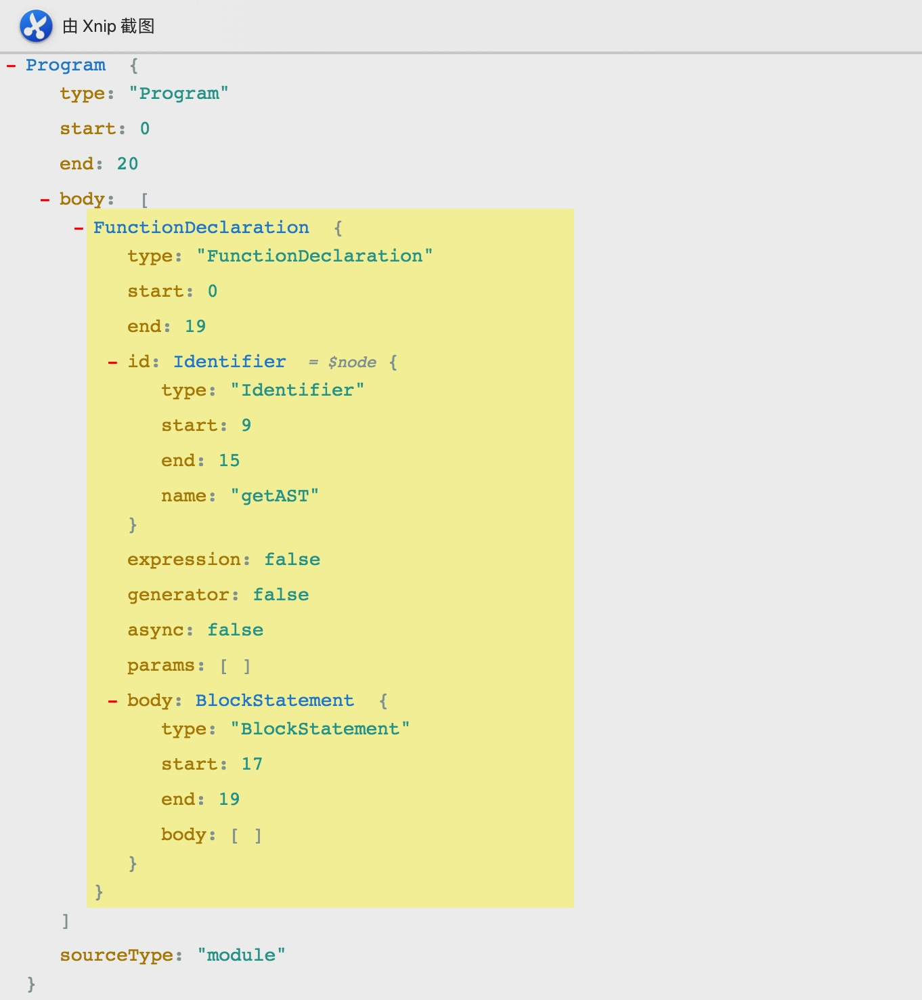

# 简述 AST


## 背景

你是否对

1. `Vue => React`
2. `React => Vue`

代码转换方法感到好奇

你是否对无痛升级旧版 React 工具`react-codemod`感到好奇

这个工具，功能十分强大，使用起来也很方便，只需要运行一行命令：

```
npx react-codemod <transform> <path> [...options]
```

这些无不借助了 AST

## 概念

什么是 AST？

> AST is a hierarchical program representation that presents source code structure according to the grammar of a programming language, each AST node corresponds to an item of a source code.

> 抽象语法树 (Abstract Syntax Tree)，简称 AST，它是源代码语法结构的一种抽象表示。它以树状的形式表现编程语言的语法结构，树上的每个节点都表示源代码中的一种结构。

> (之所以说语法是「抽象」的，是因为这里的语法并不会表示出真实语法中出现的每个细节)

在计算机科学中，`抽象语法`和`抽象语法树`其实是源代码的抽象语法结构的`树状表现形式`。

常用的浏览器就是通过将 js 代码转化为抽象语法树来进行下一步的分析等其他操作。

所以将 js 转化为抽象语法树更利于程序的分析

## 用途

- 代码语法的检查
- 代码风格的检查
- 代码的格式化
- 代码的高亮
- 代码错误提示
- 代码自动补全
- 代码压缩
- JS 反编译，语法解析
- Babel 编译 ES6 语法
- 等等。

## AST 三板斧

- 生成 AST
- 遍历和更新 AST
- 将 AST 重新生成源码

为了便于理解，我们可以看一个具体的例子，这里推荐一个工具 [https://astexplorer.net/](https://astexplorer.net/)


接下来我们来看`ES6`解释器，声明如下的代码

```js
let tips = ["Long may the sun shine"];
```

解析出的 JSON 如下

```json
{
  "type": "Program",
  "start": 0,
  "end": 43,
  "body": [
    {
      "type": "VariableDeclaration",
      "start": 0,
      "end": 42,
      "declarations": [
        {
          "type": "VariableDeclarator",
          "start": 4,
          "end": 41,
          "id": {
            "type": "Identifier",
            "start": 4,
            "end": 8,
            "name": "tips"
          },
          "init": {
            "type": "ArrayExpression",
            "start": 11,
            "end": 41,
            "elements": [
              {
                "type": "Literal",
                "start": 15,
                "end": 39,
                "value": "Long may the sun shine",
                "raw": "\"Long may the sun shine\""
              }
            ]
          }
        }
      ],
      "kind": "let"
    }
  ],
  "sourceType": "module"
}
```

而他的语法树解析为


每个结构都看的清清楚楚，这时候我们会发现，这和 Dom 树真的差不了多少。再来看一个例子：

```js
(1 + 2) * 3;
```

AST json

```json
{
  "type": "Program",
  "start": 0,
  "end": 7,
  "body": [
    {
      "type": "ExpressionStatement",
      "start": 0,
      "end": 7,
      "expression": {
        "type": "BinaryExpression",
        "start": 0,
        "end": 7,
        "left": {
          "type": "BinaryExpression",
          "start": 1,
          "end": 4,
          "left": {
            "type": "Literal",
            "start": 1,
            "end": 2,
            "value": 1,
            "raw": "1"
          },
          "operator": "+",
          "right": {
            "type": "Literal",
            "start": 3,
            "end": 4,
            "value": 2,
            "raw": "2"
          }
        },
        "operator": "*",
        "right": {
          "type": "Literal",
          "start": 6,
          "end": 7,
          "value": 3,
          "raw": "3"
        }
      }
    }
  ],
  "sourceType": "module"
}
```

这时候我们来删除括号看看 JSON 是如何变化的

```json
{
  "type": "Program",
  "start": 0,
  "end": 5,
  "body": [
    {
      "type": "ExpressionStatement",
      "start": 0,
      "end": 5,
      "expression": {
        "type": "BinaryExpression",
        "start": 0,
        "end": 5,
        "left": {
          "type": "Literal",
          "start": 0,
          "end": 1,
          "value": 1,
          "raw": "1"
        },
        "operator": "+",
        "right": {
          "type": "BinaryExpression",
          "start": 2,
          "end": 5,
          "left": {
            "type": "Literal",
            "start": 2,
            "end": 3,
            "value": 2,
            "raw": "2"
          },
          "operator": "*",
          "right": {
            "type": "Literal",
            "start": 4,
            "end": 5,
            "value": 3,
            "raw": "3"
          }
        }
      }
    }
  ],
  "sourceType": "module"
}
```

可以看出来，`（1+2)*3` 和 `1+2*3`，语法树是有差别的：

1. 在确定类型为 `ExpressionStatement` 后，它会按照代码执行的先后顺序，将表达式 `BinaryExpression` 分为 `Left`，`operator` 和 `right` 三块；
2. 每块标明了类型，起止位置，值等信息；
3. 操作符类型；

再来看看我们最常用的箭头函数：

```js
const sum = (a, b) => {
  return a + b;
};
```

JSON 格式如下：

```json
{
  "type": "Program",
  "start": 0,
  "end": 33,
  "body": [
    {
      "type": "VariableDeclaration",
      "start": 0,
      "end": 33,
      "declarations": [
        {
          "type": "VariableDeclarator",
          "start": 6,
          "end": 33,
          "id": {
            "type": "Identifier",
            "start": 6,
            "end": 9,
            "name": "sum"
          },
          "init": {
            "type": "ArrowFunctionExpression",
            "start": 10,
            "end": 33,
            "id": null,
            "expression": false,
            "generator": false,
            "async": false,
            "params": [
              {
                "type": "Identifier",
                "start": 11,
                "end": 12,
                "name": "a"
              },
              {
                "type": "Identifier",
                "start": 13,
                "end": 14,
                "name": "b"
              }
            ],
            "body": {
              "type": "BlockStatement",
              "start": 17,
              "end": 33,
              "body": [
                {
                  "type": "ReturnStatement",
                  "start": 21,
                  "end": 31,
                  "argument": {
                    "type": "BinaryExpression",
                    "start": 28,
                    "end": 31,
                    "left": {
                      "type": "Identifier",
                      "start": 28,
                      "end": 29,
                      "name": "a"
                    },
                    "operator": "+",
                    "right": {
                      "type": "Identifier",
                      "start": 30,
                      "end": 31,
                      "name": "b"
                    }
                  }
                }
              ]
            }
          }
        }
      ],
      "kind": "const"
    }
  ],
  "sourceType": "module"
}
```

AST Tree 结构如下图：


这时候我们会发现，上面JSON中增加了几个新的字眼：

- `ArrowFunctionExpression`
- `BlockStatement`
- `ReturnStatement`

> 抽象语法树其实就是将一类标签转化成通用标识符，从而结构出的一个类似于树形结构的语法树。

## 深入原理

> 可视化的工具可以让我们迅速有感官认识，那么具体内部是如何实现的呢？

例如下面这个例子

```js
function getAST() {}
```

json

```json
{
  "type": "Program",
  "start": 0,
  "end": 20,
  "body": [
    {
      "type": "FunctionDeclaration",
      "start": 0,
      "end": 19,
      "id": {
        "type": "Identifier",
        "start": 9,
        "end": 15,
        "name": "getAST"
      },
      "expression": false,
      "generator": false,
      "async": false,
      "params": [],
      "body": {
        "type": "BlockStatement",
        "start": 17,
        "end": 19,
        "body": []
      }
    }
  ],
  "sourceType": "module"
}
```

AST TREE



当我们尝试用用代码去模拟实现

```js
const esprima = require("esprima"); //解析js的语法的包
const estraverse = require("estraverse"); //遍历树的包
const escodegen = require("escodegen"); //生成新的树的包

let code = `function getAST(){}`;
//解析js的语法
let tree = esprima.parseScript(code);
//遍历树
estraverse.traverse(tree, {
  enter(node) {
    console.log("enter: " + node.type);
  },
  leave(node) {
    console.log("leave: " + node.type);
  }
});
//生成新的树
let result = escodegen.generate(tree);
console.log(result);
```

运行后，输出：

```
enter: Program
enter: FunctionDeclaration
enter: Identifier
leave: Identifier
enter: BlockStatement
leave: BlockStatement
leave: FunctionDeclaration
leave: Program
function getAST() {
}
```

以上就是我们看到了遍历语法树的过程。
稍作修改，我们来改变函数的名字 `getAST => IWantGetAST`：

```js
const esprima = require("esprima"); //解析js的语法的包
const estraverse = require("estraverse"); //遍历树的包
const escodegen = require("escodegen"); //生成新的树的包

let code = `function getAST(){}`;
//解析js的语法
let tree = esprima.parseScript(code);
//遍历树
estraverse.traverse(tree, {
  enter(node) {
    console.log("enter: " + node.type);
    if (node.type === "Identifier") {
      node.name = "IWantGetAst";
    }
  }
});
//生成新的树
let result = escodegen.generate(tree);
console.log(result);
```

运行后，输出：

```
enter: Program
enter: FunctionDeclaration
enter: Identifier
enter: BlockStatement
function IWantGetAst() {
}
```

可以看到，在我们的干预下，输出的结果发生了变化，方法名编译后方法名变成了 `IWantGetAst`。

> 这就是抽象语法树的强大之处，本质上通过编译，我们可以去改变任何输出结果。

补充一点：关于 `node` 类型，大致如下：

```
(parameter) node: Identifier | SimpleLiteral | RegExpLiteral | Program | FunctionDeclaration | FunctionExpression | ArrowFunctionExpression | SwitchCase | CatchClause | VariableDeclarator | ExpressionStatement | BlockStatement | EmptyStatement | DebuggerStatement | WithStatement | ReturnStatement | LabeledStatement | BreakStatement | ContinueStatement | IfStatement | SwitchStatement | ThrowStatement | TryStatement | WhileStatement | DoWhileStatement | ForStatement | ForInStatement | ForOfStatement | VariableDeclaration | ClassDeclaration | ThisExpression | ArrayExpression | ObjectExpression | YieldExpression | UnaryExpression | UpdateExpression | BinaryExpression | AssignmentExpression | LogicalExpression | MemberExpression | ConditionalExpression | SimpleCallExpression | NewExpression | SequenceExpression | TemplateLiteral | TaggedTemplateExpression | ClassExpression | MetaProperty | AwaitExpression | Property | AssignmentProperty | Super | TemplateElement | SpreadElement | ObjectPattern | ArrayPattern | RestElement | AssignmentPattern | ClassBody | MethodDefinition | ImportDeclaration | ExportNamedDeclaration | ExportDefaultDeclaration | ExportAllDeclaration | ImportSpecifier | ImportDefaultSpecifier | ImportNamespaceSpecifier | ExportSpecifier
```

现在是不是想到了`babel`，`代码压缩 UglifyJS2`？

大家可以思考，如何删除下面这段代码中的`console`,（[答案](https://github.com/MrSeaWave/js-ast-demo/blob/master/src/deleteConsole.js)）

```js
function deleteConsole() {
  console.log("delete console");
}
```

## 总结

AST 三板斧

1. js 语法解析成 AST；
1. 修改 AST；
1. AST 转成 js 语法；

## 参考链接

- [Abstract syntax tree](https://en.wikipedia.org/wiki/Abstract_syntax_tree)
- [手把手带你入门 AST 抽象语法树](https://juejin.im/post/5e0a245df265da33cf1aea91)
- [AST 抽象语法树](http://jartto.wang/2018/11/17/about-ast/)
- [Javascript 抽象语法树下篇(实践篇)](https://juejin.im/post/5d779f58e51d45620821cf58)
- [js-code-to-svg-flowchart](https://github.com/Bogdan-Lyashenko/js-code-to-svg-flowchart)
