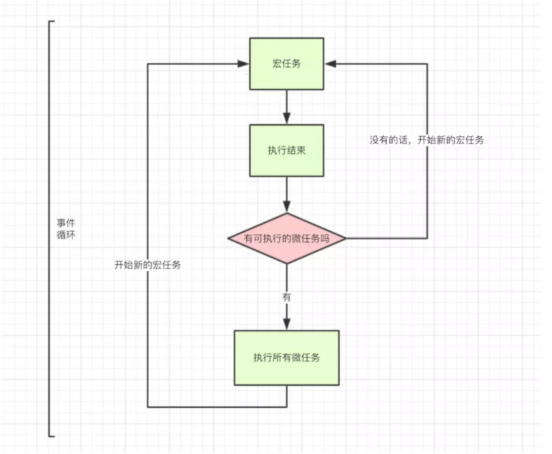

# Event loop
## 牢记

1. JS是单线程语言

2. JS的Event Loop是JS的执行机制。深入了解JS的执行,就等于深入了解JS里的event loop
## event loop


```
setTimeout(function(){
     console.log('定时器开始啦')
 });

 new Promise(function(resolve){
     console.log('马上执行for循环啦');
     for(var i = 0; i < 10000; i++){
         i == 99 && resolve();
     }
 }).then(function(){
     console.log('执行then函数啦')
 });

 console.log('代码执行结束');
```
正确的执行顺序是
```
【马上执行for循环啦 --- 代码执行结束 --- 执行then函数啦 --- 定时器开始啦】
```

  

- macro-task(宏任务)：包括整体代码script，setTimeout，setInterval
- micro-task(微任务)：Promise，process.nextTick

按照这种分类方式:JS的执行机制是

- 执行一个宏任务,过程中如果遇到微任务,就将其放到微任务的【事件队列】里
- 当前宏任务执行完成后,会查看微任务的【事件队列】,并将里面全部的微任务依次执行完

重复以上2步骤，就是更为准确的JS执行机制

## 浅谈setTimeout
一般说: 3秒后,会执行setTimeout里的那个函数
```
setTimeout(function(){
    console.log('执行了')
 },3000)
```
但是这种说并不严谨,准确的解释是: 3秒后,setTimeout里的函数被会推入event queue,而event queue(事件队列)里的任务,只有在主线程空闲时才会执行。

所以只有满足 (1)3秒后 (2)主线程空闲,同时满足时,才会3秒后执行该函数

如果主线程执行内容很多,执行时间超过3秒,比如执行了10秒,那么这个函数只能10秒后执行了

## 测试
```
async function async1() {
  console.log("async1 start");

  await async2();

  console.log("async1 end");
}

async function async2() {
  console.log("async2");
}

console.log("script start");

setTimeout(function() {
  console.log("setTimeout");
}, 0);

async1();

new Promise(function(resolve) {
  console.log("promise1");

  resolve();
}).then(function() {
  console.log("promise2");
});

console.log("script end");
```
`答案是以浏览器的eventloop机制为准`
`chrome版本 70.0.3538.110（正式版本） （64 位）`
输出顺序
```
script start
async1 start
async2
promise1
script end
promise2
async1 end
setTimeout
```
`node`输出顺序
```
script start
async1 start
async2
promise1
script end
async1 end
promise2
setTimeout
```
## 参考链接
[segmentfault,10分钟理解JS引擎的执行机制](https://segmentfault.com/a/1190000012806637)
