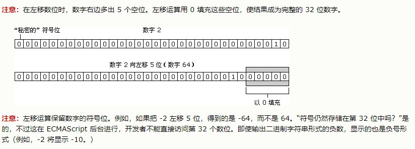
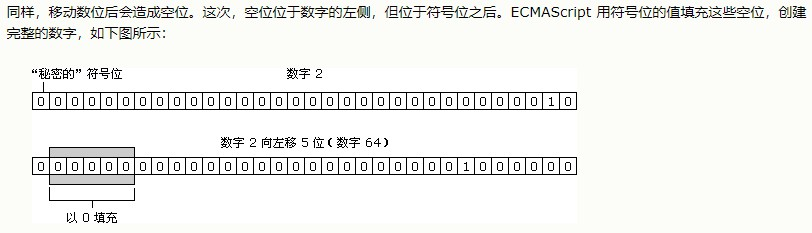

# 位运算符

## 位运算 NOT ~

位运算 NOT 由否定号（~）表示

位运算 NOT 是三步的处理过程：

- 把运算数转换成 32 位数字
- 把二进制数转换成它的二进制反码
- 把二进制数转换成浮点数

位运算 NOT 实质上是对数字求负，然后减 1

```js
var iNum1 = 25; //25 等于 00000000000000000000000000011001
var iNum2 = ~iNum1; //转换为 11111111111111111111111111100110
alert(iNum2); //输出 "-26"

var iNum1 = 25;
var iNum2 = -iNum1 - 1;
alert(iNum2); //输出 -26
```

## 位运算 AND &

位运算 AND 由和号（&）表示，直接对数字的二进制形式进行运算。它把每个数字中的数位对齐，然后对同一位置上的两个数位进行 AND 运算：

```
var iResult = 25 & 3;
alert(iResult);	//输出 "1"
```
```
 25 = 0000 0000 0000 0000 0000 0000 0001 1001
  3 = 0000 0000 0000 0000 0000 0000 0000 0011
---------------------------------------------
AND = 0000 0000 0000 0000 0000 0000 0000 0001
```
## 位运算 OR |
位运算 OR 由符号（|）表示，也是直接对数字的二进制形式进行运算。
```
var iResult = 25 | 3;
alert(iResult);	//输出 "27"
```
```
25 = 0000 0000 0000 0000 0000 0000 0001 1001
 3 = 0000 0000 0000 0000 0000 0000 0000 0011
--------------------------------------------
OR = 0000 0000 0000 0000 0000 0000 0001 1011
```
## 位运算 XOR ^
位运算 XOR 由符号（^）表示，当然，也是直接对二进制形式进行运算。XOR 不同于 OR，当只有一个数位存放的是 1 时，它才返回 1。


第一个数字中的数位|第二个数字中的数位|结果|
:--:|:--:|:--:|
1 |1 |0
0 |1 |1
1 |0 |1
0 |0 |0

```
var iResult = 25 ^ 3;
alert(iResult);	//输出 "26"
```
```
 25 = 0000 0000 0000 0000 0000 0000 0001 1001
  3 = 0000 0000 0000 0000 0000 0000 0000 0011
---------------------------------------------
XOR = 0000 0000 0000 0000 0000 0000 0001 1010
```

## 左移运算 <<

左移运算由两个小于号表示（<<）。它把数字中的所有数位向左移动指定的数量。例如，把数字 2（等于二进制中的 10）左移 5 位，结果为 64（等于二进制中的 1000000）：

```
var iOld = 2;		//等于二进制 10
var iNew = iOld << 5;	//等于二进制 1000000 十进制 64
```


## 有符号右移运算 >>
有符号右移运算符由两个大于号表示（>>）。它把 32 位数字中的所有数位整体右移，同时保留该数的符号（正号或负号）。有符号右移运算符恰好与左移运算相反。例如，把 64 右移 5 位，将变为 2：
```
var iOld = 64;		//等于二进制 1000000
var iNew = iOld >> 5;	//等于二进制 10 十进制 2
var iOld = 18;		//等于二进制 10010
var iNew = iOld >> 2;	//等于二进制 100 十进制 4
var iOld = 18;		//等于二进制 10010
var iNew = iOld >> 5;	//等于二进制 0 十进制 0

```


## 无符号右移运算 >>>
无符号右移运算符由三个大于号（>>>）表示，它将无符号 32 位数的所有数位整体右移。对于正数，无符号右移运算的结果与有符号右移运算一样。

用有符号右移运算中的例子，把 64 右移 5 位，将变为 2：
```
var iOld = 64;		//等于二进制 1000000
var iNew = iOld >>> 5;	//等于二进制 10 十进制 2
```
对于负数，情况就不同了。

无符号右移运算用 0 填充所有空位。对于正数，这与有符号右移运算的操作一样，而负数则被作为正数来处理。

由于无符号右移运算的结果是一个 32 位的正数，所以负数的无符号右移运算得到的总是一个非常大的数字。例如，如果把 -64 右移 5 位，将得到 134217726。如何得到这种结果的呢？

要实现这一点，需要把这个数字转换成无符号的等价形式（尽管该数字本身还是有符号的），可以通过以下代码获得这种形式：
```
var iUnsigned64 = -64 >>> 0;
```
然后，用 Number 类型的 toString() 获取它的真正的位表示，采用的基为 2：

```
alert(iUnsigned64.toString(2));
```
这将生成 11111111111111111111111111000000，即有符号整数 -64 的二进制补码表示，不过它等于无符号整数 4294967232。

出于这种原因，使用无符号右移运算符要小心。
