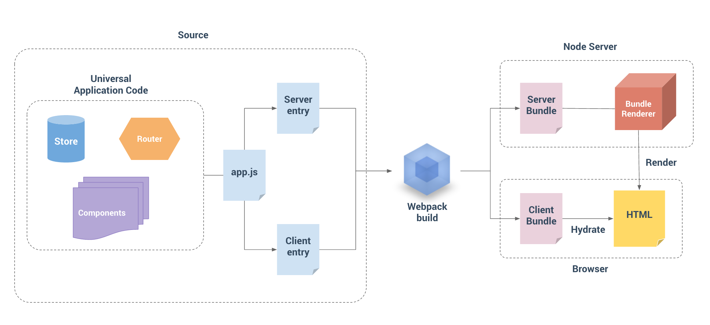

# SSR

## ssr

## 为什么要使用服务端渲染(Server side rendering )

1. 公司的站点很注重SEO，页面又是异步获取内容；
2. 首屏性能,希望用户更快速地看到完整渲染的页面，从而提高用户体验。

基于这两点，所以需要服务器端渲染(SSR)来解决这些问题

## 参考链接
- [精读前后端渲染之争](https://github.com/camsong/blog/issues/8)
- [React16.x中的服务端渲染](https://yq.aliyun.com/articles/610245)

