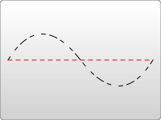

# SVG
## 概述
SVG 意为可缩放矢量图形（Scalable Vector Graphics）。本质上是文本文件，体积较小，且不管放大多少倍都不会失真

SVG 使用 XML 格式定义图像，SVG 面向图形，HTML 面向文本

## 网格&&像素
对于所有元素，SVG使用的坐标系统或者说网格系统，和Canvas用的差不多（所有计算机绘图都差不多）。
这种坐标系统是：以页面的左上角为(0,0)坐标点，坐标以像素为单位，x轴正方向是向右，y轴正方向是向下。
注意，这和小时候所教的绘图方式是相反的。但是在HTML文档中，元素都是用这种方式定位的


基本上，在 SVG 文档中的1个像素对应输出设备（比如显示屏）上的1个像素。但是这种情况是可以改变的，
否则 SVG 的名字里也不至于会有“Scalable”（可缩放）这个词。如同CSS可以定义字体的绝对大小和相对大小，
SVG也可以定义绝对大小（比如使用“pt”或“cm”标识维度）同时SVG也能使用相对大小，只需给出数字，
不标明单位，输出时就会采用用户的单位。

在没有进一步规范说明的情况下，1个用户单位等同于1个屏幕单位。
要明确改变这种设定，SVG里有多种方法。从svg根元素开始：
```
<svg width="100" height="100">
```
上面的元素定义了一个100*100px的SVG画布，这里1用户单位等同于1屏幕单位。

```
<svg width="200" height="200" viewBox="0 0 100 100">
```
这里定义的画布尺寸是`200*200px`。但是，`viewBox`属性定义了画布上可以显示的区域：从`(0,0)`点开始，`100宽*100高`的区域。这个`100*100`的区域，会放到`200*200`的画布上显示。于是就形成了放大两倍的效果。

用户单位和屏幕单位的映射关系被称为用户坐标系统。除了缩放之外，坐标系统还可以旋转、倾斜、翻转。默认的用户坐标系统1用户像素等于设备上的1像素（但是设备上可能会自己定义1像素到底是多大）。在定义了具体尺寸单位的SVG中，比如单位是“cm”或“in”，最终图形会以实际大小的1比1比例呈现。

## 使用
### SVG IN HTML

SVG 文件可通过以下标签嵌入 HTML 文档：``、`<embed>`、`<object>` 或者 `<iframe>`

------------------------------------------------------------------

- ``
```

```
- `<embed>`
    -  优势：所有主要浏览器都支持，并允许使用脚本
    -  缺点：不推荐在HTML4和XHTML中使用（但在HTML5允许）
```
<embed  src="test.svg" type="image/svg+xml">
```
- `<object>`
    - 优势：所有主要浏览器都支持，并支持HTML4，XHTML和HTML5标准
    - 缺点：不允许使用脚本。
```
<object data="test.svg" type="image/svg+xml"/>
```
- ` <iframe>`
    - 优势：所有主要浏览器都支持，并允许使用脚本
    - 缺点：不推荐在HTML4和XHTML中使用（但在HTML5允许）
```
<iframe src="circle1.svg"></iframe>
```
### SVG IN CSS
```
.logo {
  background: url(icon.svg);
}
```
### SVG-->BASE64
SVG 文件还可以转为 BASE64 编码，然后作为 Data URI 写入网页。
```

```

## 语法（部分）
### `<svg>`标签
---
SVG 代码都放在顶层标签`<svg>`之中
```
<svg width="100%" height="100%">
  <circle id="mycircle" cx="50" cy="50" r="50" />
</svg>
```
`<svg>`的`width`属性和`height`属性，指定了 SVG 图像在 HTML 元素中所占据的宽度和高度。除了相对单位，也可以采用绝对单位（单位：像素）。如果不指定这两个属性，SVG 图像默认大小是300像素（宽） x 150像素（高）。

如果只想展示 SVG 图像的一部分，就要指定`viewBox`属性。
```
<svg width="100" height="100" viewBox="50 50 50 50">
  <circle id="mycircle" cx="50" cy="50" r="50" />
</svg>
```
`<viewBox>`属性的值有四个数字，分别是左上角的横坐标和纵坐标、视口的宽度和高度。上面代码中，SVG 图像是100像素宽 x 100像素高，`viewBox`属性指定视口从`(50, 50)`这个点开始。所以，实际看到的是右下角的四分之一圆。

注意，视口必须适配所在的空间。上面代码中，视口的大小是 `50 x 50`，由于 SVG 图像的大小是 `100 x 100`，所以视口会放大去适配 SVG 图像的大小，即放大了四倍。

如果不指定`width`属性和`height`属性，只指定`viewBox`属性，则相当于只给定 SVG 图像的长宽比。这时，SVG 图像的默认大小将等于所在的 HTML 元素的大小。

### `<rect>`标签
---
`<rect>`标签用于绘制矩形。
```
<svg width="300" height="180">
  <rect x="0" y="0" height="100" width="200" style="stroke: #70d5dd; fill: #dd524b" />
</svg>
<svg width="120" height="120"
     viewBox="0 0 120 120"
     xmlns="http://www.w3.org/2000/svg">

  <rect x="10" y="10"
        width="100" height="100"
        rx="15" ry="15"/>

</svg>
```
专有属性
- x 矩形左上角端点的横坐标
- y 矩形左上角端点的纵坐标
- width 矩形的宽度 （单位像素）
- height 矩形的高度（单位像素）
- rx 可使矩形产生圆角。
- ry 可使矩形产生圆角。

### `<circle>`标签
---
`<circle>`标签用于绘制圆形。
```
<svg viewBox="0 0 120 120" version="1.1"
  xmlns="http://www.w3.org/2000/svg">
  <circle cx="60" cy="60" r="50"/>
</svg>

<svg width="300" height="180">
  <circle cx="30"  cy="50" r="25" />
  <circle cx="90"  cy="50" r="25" />
  <circle cx="150" cy="50" r="25"  />
</svg>
```
专有属性 (单位为像素)
- cx 横坐标
- cy 纵坐标
- r 半径
坐标都是相对于`<svg>`画布的左上角原点。

### `<ellipse>`标签
---
`<ellipse>`标签用于绘制椭圆。
```
<svg width="300" height="180">
  <ellipse cx="60" cy="60" ry="40" rx="20" stroke="black" stroke-width="5" fill="silver"/>
</svg>
```
专有属性（单位像素）
- cx 属性定义圆点的 x 坐标
- cy 属性定义圆点的 y 坐标
- rx 属性定义水平半径,椭圆横向轴半径
- ry 属性定义垂直半径，纵向轴的半径

### `<line>`标签
---
`<line>` 标签用来创建线条
```
<svg width="300" height="180">
  <line x1="0" y1="0" x2="200" y2="0" style="stroke:rgb(0,0,0);stroke-width:5" />
</svg>
```
专有属性（单位像素）
- x1 属性在 x 轴定义线条的开始，起点横坐标
- y1 属性在 y 轴定义线条的开始，起点纵坐标
- x2 属性在 x 轴定义线条的结束，终点横坐标
- y2 属性在 y 轴定义线条的结束，终点纵坐标

### `<polyline>`标签
---
`<polyline>` 创建仅包含直线的形状。绘制一根折线。
```
<svg width="300" height="180">
  <polyline points="3,3 30,28 3,53" fill="none" stroke="black" />
</svg>
```
专有属性
- points 属性指定了每个端点的坐标，横坐标与纵坐标之间与逗号分隔，点与点之间用空格分隔。
### `<polygon>`标签
---
`<polygon>` 标签用于绘制多边形。
```
<svg width="300" height="180">
  <polygon fill="green" stroke="orange" stroke-width="1" points="0,0 100,0 100,100 0,100 0,0"/>
</svg>
<svg>
  <polygon points="100,10 250,150 150,110"
           style="fill:lime;stroke:purple;stroke-width:1" />
</svg>
```
专有属性
- points 属性指定了每个端点的坐标，横坐标与纵坐标之间与逗号分隔，点与点之间用空格分隔。

### `<path>`标签
---
`<path>` 标签用来定义路径。
```
<svg width="100%" height="100%" viewBox="0 0 400 400"
     xmlns="http://www.w3.org/2000/svg">

  <path d="M 100 100 L 300 100 L 200 300 z"
        fill="orange" stroke="black" stroke-width="3" />
</svg>

<svg width="300" height="180">
<path d="
  M 18,3
  L 46,3
  L 46,40
  L 61,40
  L 32,68
  L 3,40
  L 18,40
  Z
"></path>
</svg>
```
专有属性
- d 属性表示绘制顺序，它的值是一个长字符串，每个字母表示一个绘制动作，后面跟着坐标。
- pathLength

路径数据
```
M = moveto
L = lineto
H = horizontal lineto
V = vertical lineto
C = curveto
S = smooth curveto
Q = quadratic Belzier curve
T = smooth quadratic Belzier curveto
A = elliptical Arc
Z = closepath
```
<strong>注释</strong>：以上所有命令均允许小写字母。大写表示绝对定位，小写表示相对定位。

### `<use>`标签
---
`<use>` 标签用于复制一个形状。
```
<svg viewBox="0 0 30 10" xmlns="http://www.w3.org/2000/svg">
  <circle id="myCircle" cx="5" cy="5" r="4"/>

  <use href="#myCircle" x="10" y="0" fill="blue" />
  <use href="#myCircle" x="20" y="0" fill="white" stroke="blue" />
</svg>

<svg width="100%" height="100%" xmlns="http://www.w3.org/2000/svg" xmlns:xlink="http://www.w3.org/1999/xlink">
  <style>
    .classA { fill:red }
  </style>
  <defs>
    <g id="Port">
      <circle style="fill:inherit" r="10"/>
    </g>
  </defs>

  <text y="15">black</text>
  <use x="50" y="10" xlink:href="#Port" />
  <text y="35">red</text>
  <use x="50" y="30" xlink:href="#Port" class="classA"/>
  <text y="55">blue</text>
  <use x="50" y="50" xlink:href="#Port" style="fill:blue"/>
 </svg>
```
专有属性
- x `<use>` 左上角的横坐标
- y `<use>` 左上角的纵坐标
- width
- height
- xlink:href / href 属性指定所要复制的节点，

### `<text>`标签
---
`<text>` 标签用于绘制文本。
```
<svg width="300" height="180">
  <text x="50" y="25">Hello World</text>
</svg>
<svg width="300" height="150" xmlns="http://www.w3.org/2000/svg">
   <g font-face="sans-serif">
      <text x="0" y="20" textLength="300" lengthAdjust="spacing">
         Stretched using spacing only.
      </text>
      <text x="0" y="50" textLength="300" lengthAdjust="spacingAndGlyphs">
         Stretched using spacing and glyphs.
      </text>
      <text x="0" y="80" textLength="100" lengthAdjust="spacing">
         Shrunk using spacing only.
      </text>
      <text x="0" y="110" textLength="100" lengthAdjust="spacingAndGlyphs">
         Shrunk using spacing and glyphs.
      </text>
   </g>
</svg>
```
专有属性
- x 表示文本区块基线（baseline）起点的横坐标
- y 表示文本区块基线（baseline）起点的纵坐标
- dx 属性表示一个元素或其内容在x轴方向上的偏移，偏移量取决于设置该属性的元素。
- dy 文本相对基点y向下偏移的距离
- text-anchor 文本锚点属性被用来描述该文本与所给点的对齐方式 (开头`start `、中间`middle `、末尾`end `对齐) 。
- rotate
- textLength 文本长度
- lengthAdjust 调整文本的收缩或扩张方式，与`textLength`属性配合使用， `spacing` 单个文字大小不变，只收缩或扩张间距，`spacingAndGlyphs` 文字和间距一起扩张或收缩

### `<g>`标签
---
`<g>` 标签用于将多个形状组成一个组（group），方便复用。
```
<svg width="300" height="100">
  <g id="myCircle">
    <text x="25" y="20">圆形</text>
    <circle cx="50" cy="50" r="20"/>
  </g>

  <use href="#myCircle" x="100" y="0" fill="blue" />
  <use href="#myCircle" x="200" y="0" fill="white" stroke="blue" />
</svg>
```

### `<defs>`标签
---
`<defs>` 标签用于自定义形状，它内部的代码不会显示，仅供引用。

在defs元素中定义的图形元素不会直接呈现。 你可以在你的视口的任意地方利用 <use>元素呈现这些元素。
```
<svg width="300" height="100">
  <defs>
    <g id="myCircle">
      <text x="25" y="20">圆形</text>
      <circle cx="50" cy="50" r="20"/>
    </g>
  </defs>

  <use href="#myCircle" x="0" y="0" />
  <use href="#myCircle" x="100" y="0" fill="blue" />
  <use href="#myCircle" x="200" y="0" fill="white" stroke="blue" />
</svg>
```

### `<pattern>`标签
---
`<pattern>` 标签用于自定义一个形状，该形状可以被引用来平铺一个区域。

```
<svg width="500" height="500" >
  <defs>
    <pattern id="dots" x="0" y="0" width="100" height="100" patternUnits="userSpaceOnUse">
      <circle fill="#bee9e8" cx="50" cy="50" r="35" />
    </pattern>
	  <pattern id="p2" x=".125" y=".125" width=".25" height=".25"
           patternUnits="objectBoundingBox">
    <circle cx="10" cy="10" r="10" />
  </pattern>
  </defs>
  <rect x="0" y="0" width="100%" height="100%" fill="url(#dots)" />
<rect x="110" y="400" width="80" height="80" fill="url(#p2)" />
</svg>
```
专有属性
- x
- y
- width
- height
- patternUnits `userSpaceOnUse`或`objectBoundingBox`，图案填充
- patternContentUnits `userSpaceOnUse`或`objectBoundingBox`
- patternTransform 允许整个表达式进行转换
- xlink:href
- preserveAspectRatio


 `userSpaceOnUse` ：`x`、`y`、`width`和`height`表示的值都是当前用户坐标系统的值。也就是说，这些值没有缩放，都是绝对值。

 `objectBoundingBox` (默认值)：`x`、`y`、`width`和`height`的值都是占外框（包裹`pattern`的元素）的百分比。

### `<image>`标签
---
`<image>` 标签用于插入图片文件。
```
<svg viewBox="0 0 100 100" width="100" height="100">
  <image xlink:href="path/to/image.jpg"
    width="50%" height="50%"/>
</svg>
```
专有属性
- x
- y
- width 图像宽度。和HTML的``不同，该属性是必须的
- height 图像高度。和HTML的``不同，该属性是必须的
- xlink:href：图像的URL指向
- preserveAspectRatio：控制图像比例

### `<animate>`标签
---
`<animate>` 标签用于产生动画效果。
```
<svg width="500px" height="500px">
  <rect x="0" y="0" width="100" height="100" fill="#feac5e">
    <animate attributeName="x" from="0" to="500" dur="2s" repeatCount="indefinite" />
  </rect>
</svg>
```
专有属性
- attributeName 发生动画效果的属性名。
- attributeType 该属性指定目标属性和它相对应的值处于哪个命名空间里。`CSS`|`XML`|`auto`
- from 单次动画的初始值。
- to 单次动画的结束值。
- dur 单次动画的持续时间。
- repeatCount 这个属性的值指定了重复的次数。它也可以包括用分数值表示。它的值必须大于0。`indefinite`：无限

attributeType:
```
CSS
指定attributeName的值是一个CSS属性名。

XML
指定attributeName的值是一个XML属性名，在目标元素的默认XML命名空间里。
auto
编译器将把attributeName匹配到目标元素的一个属性。用户代理先搜索CSS属性列表以找出一个匹配的属性名，如果找不到，再为这个元素搜索默认XML命名空间。
```


### `<animateTransform>`标签
---
`<animate>` 标签对 CSS 的`transform`属性不起作用，如果需要变形，就要使用`<animateTransform>`标签。
```
<svg width="500px" height="500px">
  <rect x="250" y="250" width="50" height="50" fill="#4bc0c8">
    <animateTransform attributeName="transform" type="rotate" begin="0s" dur="10s" from="0 200 200" to="360 400 400" repeatCount="indefinite" />
  </rect>
</svg>
```
专有属性
- by 相对偏移值
- from 属性值有三个数字，第一个数字是角度值，第二个值和第三个值是旋转中心的坐标
- to
- type 类型的转换其值是随时间变化,可以是 `translate`， `scale`，`rotate`，`skewX`， `skewY`

## SVG 样式，填充和边框
### Fill 和 Stroke 属性
```
<rect x="10" y="10" width="100" height="100" stroke="blue" fill="purple"
       fill-opacity="0.5" stroke-opacity="0.8"/>
```
`fill`属性和`stroke`属性。`fill`属性设置对象内部的颜色，`stroke`属性设置绘制对象的线条的颜色。可以使用在HTML中的CSS颜色命名方案定义它们的颜色，比如说颜色名（像`red`这种）、`rgb`值（像`rgb(255,0,0)`这种）、十六进制值、rgba值，等等
属性`fill-opacity`控制填充色的不透明度，属性`stroke-opacity`控制描边的不透明度。

#### 描边

##### 1 除了颜色属性，还有其他一些属性用来控制绘制描边的方式


```
<svg width="160" height="140" xmlns="http://www.w3.org/2000/svg" version="1.1">
  <line x1="40" x2="120" y1="20" y2="20" stroke="black" stroke-width="20" stroke-linecap="butt"/>
  <line x1="40" x2="120" y1="60" y2="60" stroke="black" stroke-width="20" stroke-linecap="square"/>
  <line x1="40" x2="120" y1="100" y2="100" stroke="black" stroke-width="20" stroke-linecap="round"/>
</svg>
```
`stroke-width`属性定义了描边的宽度。注意，描边是以路径为中心线绘制的，在上面的例子里，路径是粉红色的，描边是黑色的。如你所见，路径的每一侧都有均匀分布的描边。

第二个影响描边的属性是`stroke-linecap`属性，如上所示。它控制边框终点的形状。

`stroke-linecap`属性的值有三种可能值：

- `butt`用直边结束线段，它是常规做法，线段边界90度垂直于描边的方向、贯穿它的终点。
- `square`的效果差不多，但是会稍微超出实际路径的范围，超出的大小由`stroke-width`控制。
- `round`表示边框的终点是圆角，圆角的半径也是由`stroke-width`控制的。


##### 2 还有一个`stroke-linejoin`属性，用来控制两条描边线段之间，用什么方式连接。


```
<svg width="160" height="280" xmlns="http://www.w3.org/2000/svg" version="1.1">
  <polyline points="40 60 80 20 120 60" stroke="black" stroke-width="20"
      stroke-linecap="butt" fill="none" stroke-linejoin="miter"/>

  <polyline points="40 140 80 100 120 140" stroke="black" stroke-width="20"
      stroke-linecap="round" fill="none" stroke-linejoin="round"/>

  <polyline points="40 220 80 180 120 220" stroke="black" stroke-width="20"
      stroke-linecap="square" fill="none" stroke-linejoin="bevel"/>
</svg>
```

每条折线都是由两个线段连接起来的，连接处的样式由`stroke-linejoin`属性控制，它有三个可用的值，`miter`是默认值，表示用方形画笔在连接处形成尖角，`round`表示用圆角连接，实现平滑效果。最后还有一个值`bevel`，连接处会形成一个斜接。

##### 3 最后，可以通过指定`stroke-dasharray`属性，将虚线类型应用在描边上


```
<svg width="200" height="150" xmlns="http://www.w3.org/2000/svg" version="1.1">
  <path d="M 10 75 Q 50 10 100 75 T 190 75" stroke="black"
    stroke-linecap="round" stroke-dasharray="5,10,5" fill="none"/>
  <path d="M 10 75 L 190 75" stroke="red"
    stroke-linecap="round" stroke-width="1" stroke-dasharray="5,5" fill="none"/>
</svg>
```
`stroke-dasharray`属性的参数，是一组用逗号分割的数字组成的数列。注意，和`path`不一样，这里的数字必须用逗号分割（空格会被忽略）。每一组数字，第一个用来表示填色区域的长度，第二个用来表示非填色区域的长度。所以在上面的例子里，第二个路径会先做5个像素单位的填色，紧接着是5个空白单位，然后又是5个单位的填色。如果想要更复杂的虚线模式，可以定义更多的数字。第一个例子指定了3个数字，这种情况下，数字会循环两次，形成一个偶数的虚线模式（奇数个循环两次变偶数个）。所以该路径首先渲染5个填色单位，10个空白单位，5个填色单位，然后回头以这3个数字做一次循环，但是这次是创建5个空白单位，10个填色单位，5个空白单位。通过这两次循环得到偶数模式，并将这个偶数模式不断重复。

##### 4 另外还有一些关于填充和边框的属性，包括`fill-rule`，用于定义如何给图形重叠的区域上色；`stroke-miterlimit`，定义什么情况下绘制或不绘制边框连接的`miter`效果；还有`stroke-dashoffset`，定义虚线开始的位置

### 使用CSS
除了定义对象的属性外，也可以通过CSS来样式化填充和描边。语法和在html里使用CSS一样，只不过要把`background-color`、`border`改成`fill`和`stroke`。
注意，不是所有的属性都能用CSS来设置。上色和填充的部分一般是可以用CSS来设置的，比如`fill`，
`stroke`，`stroke-dasharray`等，但是不包括渐变和图案等功能。另外，`width`、`height`，
以及路径的命令等等，都不能用css设置。
```
SVG规范将属性区分成properties和其他attributes，前者是可以用CSS设置的，后者不能
```

## JavaScript 操作
### DOM 操作
如果 SVG 代码直接写在 HTML 网页之中，它就成为网页 DOM 的一部分，可以直接用 DOM 操作。

```
<svg
  id="mysvg"
  xmlns="http://www.w3.org/2000/svg"
  viewBox="0 0 800 600"
  preserveAspectRatio="xMidYMid meet"
>
  <circle id="mycircle" cx="400" cy="300" r="50" />
<svg>
```
上面代码插入网页之后，就可以用 CSS 定制样式。
```
circle {
  stroke-width: 5;
  stroke: #f00;
  fill: #ff0;
}

circle:hover {
  stroke: #090;
  fill: #fff;
}
```
然后，可以用 JavaScript 代码操作 SVG。
```
var mycircle = document.getElementById('mycircle');

mycircle.addEventListener('click', function(e) {
  console.log('circle clicked - enlarging');
  mycircle.setAttribute('r', 60);
}, false);
```
上面代码指定，如果点击图形，就改写`circle`元素的`r`属性。

### 获取 SVG DOM
使用`<object>`、`<iframe>`、`<embed>`标签插入 SVG 文件，可以获取 SVG DOM。
```
var svgObject = document.getElementById('object').contentDocument;
var svgIframe = document.getElementById('iframe').contentDocument;
var svgEmbed = document.getElementById('embed').getSVGDocument();
```
注意，如果使用``标签插入 SVG 文件，就无法获取 SVG DOM。
### 读取 SVG 源码
由于 SVG 文件就是一段 XML 文本，因此可以通过读取 XML 代码的方式，读取 SVG 源码。
```
<div id="svg-container">
  <svg
    xmlns="http://www.w3.org/2000/svg"
    xmlns:xlink="http://www.w3.org/1999/xlink"
    xml:space="preserve" width="500" height="440"
  >
    <!-- svg code -->
  </svg>
</div>
```
使用`XMLSerializer`实例的`serializeToString()`方法，获取 SVG 元素的代码。
```
var svgString = new XMLSerializer()
  .serializeToString(document.querySelector('svg'));
```
### SVG 图像转为 Canvas 图像
首先，需要新建一个`Image`对象，将 SVG 图像指定到该`Image`对象的`src`属性。
```
var img = new Image();
var svg = new Blob([svgString], {type: "image/svg+xml;charset=utf-8"});

var DOMURL = self.URL || self.webkitURL || self;
var url = DOMURL.createObjectURL(svg);

img.src = url;
```
然后，当图像加载完成后，再将它绘制到`<canvas>`元素。
```
img.onload = function () {
  var canvas = document.getElementById('canvas');
  var ctx = canvas.getContext('2d');
  ctx.drawImage(img, 0, 0);
};
```


## 参考链接
- [MDN](https://developer.mozilla.org/zh-CN/docs/Web/SVG)
- [w3school](http://www.w3school.com.cn/svg/index.asp)
- [菜鸟教程](http://www.runoob.com/svg/svg-tutorial.html)
- [阮一峰](http://www.ruanyifeng.com/blog/2018/08/svg.html)