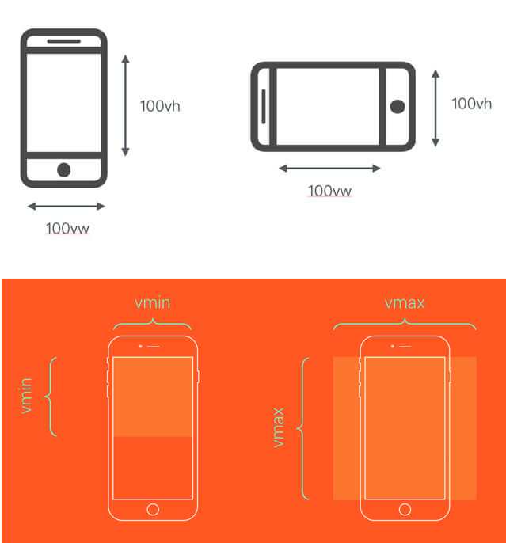

# ViewPort 移动端页面的适配

## 终端设备的参数

 [终端设备的参数](https://material.io/tools/devices/)


## 手淘设计师和前端开发的适配协作基本思路
- 选择一种尺寸作为设计和开发基准
- 定义一套适配规则，自动适配剩下的两种尺寸(其实不仅这两种，你懂的)
- 特殊适配效果给出设计效果

ui设计师设计界面时建议以iphone6的两倍尺寸（750px）为设计标准尺寸

手淘设计师常选择iPhone6作为基准设计尺寸，交付给前端的设计尺寸是按`750px * 1334px`为准(高度会随着内容多少而改变)。前端开发人员通过一套适配规则自动适配到其他的尺寸。


## 像素

### 物理像素(physical pixel)

物理像素又被称为设备像素，他是显示设备中一个最微小的物理部件。每个像素可以根据操作系统设置自己的颜色和亮度。正是这些设备像素的微小距离欺骗了我们肉眼看到的图像效果。


### 设备独立像素(density-independent pixel)

设备独立像素也称为密度无关像素，可以认为是计算机坐标系统中的一个点，这个点代表一个可以由程序使用的虚拟像素(比如说CSS像素)，然后由相关系统转换为物理像素。

### CSS像素

CSS像素是一个抽像的单位，主要使用在浏览器上，用来精确度量Web页面上的内容。一般情况之下，CSS像素称为与设备无关的像素(device-independent pixel)，简称DIPs。

### 屏幕密度

屏幕密度是指一个设备表面上存在的像素数量，它通常以每英寸有多少像素来计算(PPI)。

### 设备像素比(device pixel ratio)

设备像素比简称为dpr，其定义了物理像素和设备独立像素的对应关系。它的值可以按下面的公式计算得到：

```
设备像素比 ＝ 物理像素 / 设备独立像素
```
在JavaScript中，可以通过`window.devicePixelRatio`获取到当前设备的dpr。而在CSS中，可以通过`-webkit-device-pixel-ratio`，`-webkit-min-device-pixel-ratio`和 `-webkit-max-device-pixel-ratio`进行媒体查询，对不同dpr的设备，做一些样式适配(这里只针对webkit内核的浏览器和webview)。

dip或dp,（device independent pixels，设备独立像素）与屏幕密度有关。dip可以用来辅助区分视网膜设备还是非视网膜设备。

缩合上述的几个概念，用一张图来解释


在普通屏幕下`1`个CSS像素对应`1`个物理像素，而在`Retina`屏幕下，`1`个CSS像素对应的却是`4`个物理像素。

iPhone/iPod Touch
```
普通屏幕分辨率 ====>  320px X 480px
Retion分辨率   ====>  640px X 960px
```

换算关系

```
普通屏幕分辨率 ====>  1点=1像素
Retion分辨率   ====>  1点=2像素
```

## 适配

### Flexible

Flexible主要的思想有三点：
- 根据dpr的值来修改viewport实现1px的线
- 根据dpr的值来修改html的font-size，从而使用rem实现等比缩放
- 使用Hack手段用rem模拟vw特性

### vw

`vw`是基于Viewport视窗的长度单位，这里的视窗（Viewport）指的就是浏览器可视化的区域，而这个可视区域是`window.innerWidth/window.innerHeight`的大小.

[点此查看更多](https://www.w3cplus.com/css/viewports.html)


Viewport相关的单位有四个，分别为`vw`、`vh`、`vmin`和`vmax`

- `vw`：是Viewport's width的简写,`1vw`等于`window.innerWidth`的`1%`
- `vh`：和`vw`类似，是Viewport's height的简写，`1vh`等于`window.innerHeihgt`的`1%`
- `vmin`：`vmin`的值是当前`vw`和`vh`中较小的值
- `vmax`：`vmax`的值是当前`vw`和`vh`中较大的值



目前出视觉设计稿，我们都是使用`750px`宽度的，从上面的原理来看，那么`100vw` = `750px`，即`1vw` = `7.5px`。那么我们可以根据设计图上的`px`值直接转换成对应的`vw`值

可以使用插件转换PostCSS的插件[postcss-px-to-viewport](https://github.com/evrone/postcss-px-to-viewport)

#### 场景适配

- 容器适配，可以使用`vw`
- 文本的适配，可以使用`vw`
- 大于`1px`的边框、圆角、阴影都可以使用`vw`
- 内距和外距，可以使用`vw`

有个小问题
```css
[w-188-246] {
    width: 188px;
}

[w-187-246] {
    width: 187px
}
```
最终的效果会造成`[w-187-246]`容器的高度小于`[w-188-246]`容器的高度。这个时候我们就需要考虑到容器的长宽比缩放

> 目前采用PostCSS插件只是一个过渡阶段，在将来我们可以直接在CSS中使用`aspect-ratio`属性来实现长宽比。

可采用PostCSS插件[postcss-aspect-ratio-mini](https://github.com/yisibl/postcss-aspect-ratio-mini)

- [CSS实现长宽比的几种方案](https://www.w3cplus.com/css/aspect-ratio.html)
- [容器长宽比](https://www.w3cplus.com/css/aspect-ratio-boxes.html)
- [Web中如何实现纵横比](https://www.w3cplus.com/css/experiments-in-fixed-aspect-ratios.html)
- [实现精准的流体排版原理](https://www.w3cplus.com/css/css-polyfluidsizing-using-calc-vw-breakpoints-and-linear-equations.html)
- [CSS Grid]

#### 1px方案

// TODO
物理像素线（也就是普通屏幕下 1px ，高清屏幕下 0.5px 的情况）采用 transform 属性 scale 实现。

[1p显示](https://segmentfault.com/a/1190000016116868)
```
.mod_grid {
    position: relative;
    &::after {
        // 实现1物理像素的下边框线
        content: '';
        position: absolute;
        z-index: 1;
        pointer-events: none;
        background-color: #ddd;
        height: 1px;
        left: 0;
        right: 0;
        top: 0;
        @media only screen and (-webkit-min-device-pixel-ratio: 2) {
            -webkit-transform: scaleY(0.5);
            -webkit-transform-origin: 50% 0%;
        }
    }
    ...
}

```


### 技术点

- 使用`vw`来实现页面的适配，并且通过PostCSS的插件[postcss-px-to-viewport](https://github.com/evrone/postcss-px-to-viewport)
把`px`转换成`vw`。这样的好处是,不需要进行任何的计算，你只需要根据设计图写`px`单位
- 为了更好的实现长宽比，特别是针对于`img`、`video`和`iframe`元素，通过PostCSS插件[postcss-aspect-ratio-mini](https://github.com/yisibl/postcss-aspect-ratio-mini)
来实现，在实际使用中，只需要把对应的宽和高写进去即可
- 为了解决`1px`的问题，使用PostCSS插件[postcss-write-svg](https://github.com/jonathantneal/postcss-write-svg),
自动生成`border-image`或者`background-image`的图片


### Viewport不足之处

采用`vw`来做适配处理并不是只有好处没有任何缺点。有一些细节之处还是存在一定的缺陷的。比如当容器使用`vw`单位，
`margin`采用`px`单位时，很容易造成整体宽度超过`100vw`，从而影响布局效果。
对于类似这样的现象，可以采用相关的技术进行规避。比如将`margin`换成`padding`，
并且配合`box-sizing`。只不过这不是最佳方案，
随着将来浏览器或者应用自身的`Webview`对`calc()`函数的支持之后，碰到`vw`和`px`混合使用的时候，
可以结合`calc()`函数一起使用，这样就可以完美的解决。

另外一点，`px`转换成`vw`单位，多少还会存在一定的像素差，毕竟很多时候无法完全整除


## 参考链接
- [阿里viewport方案](https://www.w3cplus.com/css/vw-for-layout.html)
- [使用Flexible实现手淘H5页面的终端适配](https://www.w3cplus.com/mobile/lib-flexible-for-html5-layout.html)
- [再谈Retina下1px的解决方案](https://www.w3cplus.com/css/fix-1px-for-retina.html)
- [走向视网膜（Retina）的Web时代](http://www.w3cplus.com/css/towards-retina-web.html)
- [Retina.js](http://imulus.github.io/retinajs/)
- [实现精准的流体排版原理](https://www.w3cplus.com/css/css-polyfluidsizing-using-calc-vw-breakpoints-and-linear-equations.html)
- [viewports剖析](https://www.w3cplus.com/css/viewports.html)
- [利用视口单位实现适配布局](https://aotu.io/notes/2017/04/28/2017-4-28-CSS-viewport-units/index.html)
- [[翻译]使用VH和VW实现真正的流体排版](http://www.cnblogs.com/wengxuesong/archive/2016/05/16/5497653.html)
- [基于视口单位的网页排版](https://github.com/dwqs/blog/issues/5)
