# vscode 云同步

## 安装 Settings Sync

在 VSCode 中点击扩展，搜索：Settings Sync 安装

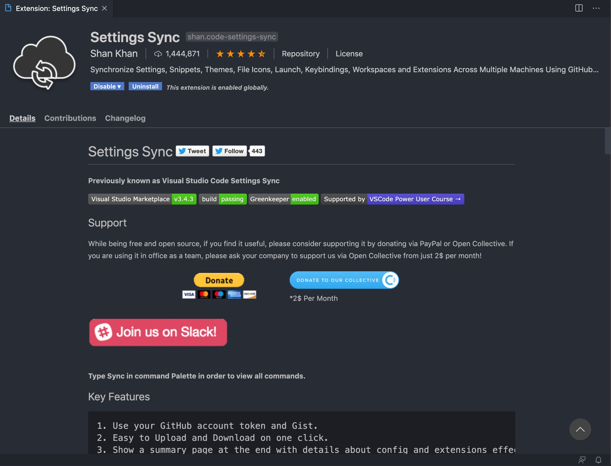

安装好扩展之后我们登录**GitHub**开通并创建一个**Gist**（代码片段管理服务）来保存你的环境配置。

登录你的**Github** 点击头像 进入**Settings**页面

在**Settings**页面点击进入 **Developer settings** （开发者设置）再点击进入**Personal access tokens** （个人授权令牌）页面生成一个令牌 点击 **Generate new token**

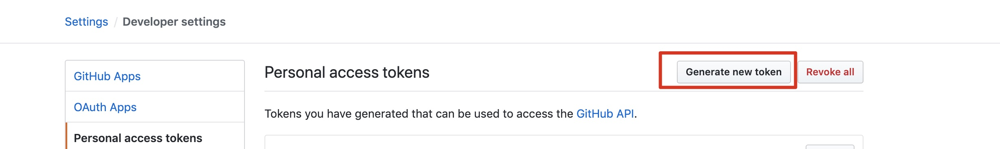

令牌的作用能帮助我们就在 VSCode 中使用自己的私有令牌访问自己的保存在 Gist 上的配置

所以我们输入令牌备注，勾选 Gist，点击生成。

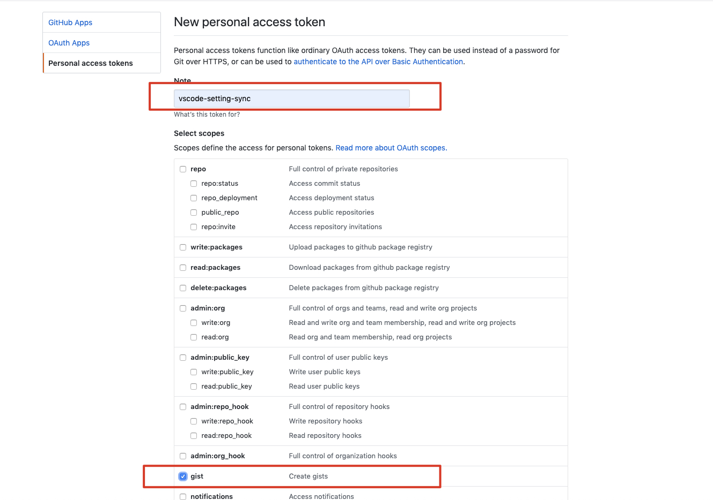

然后你就获得了自己的 Gist 专属访问令牌，你可以用记事本保存下来，待会并且未来你可能需要在另一台电脑下载你的配置 你同样需要使用到这个令牌。（截图中生成 Token 演示后删除，请自己生成）

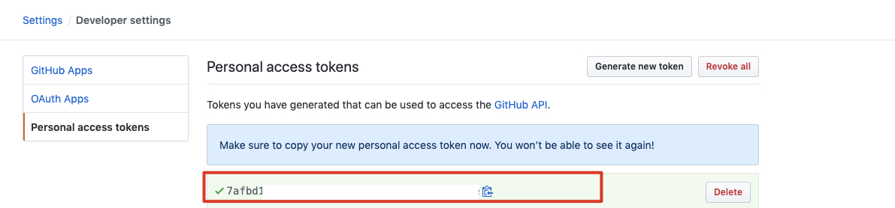

然后再次点击你的头像 点击进入->Gist 页面 点击创建一个新 Gist。

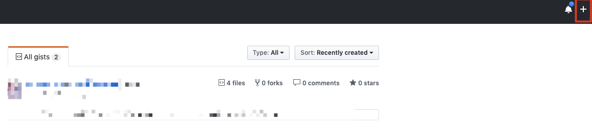

输入创建的 Gist 描述和片段内容，保存即可。

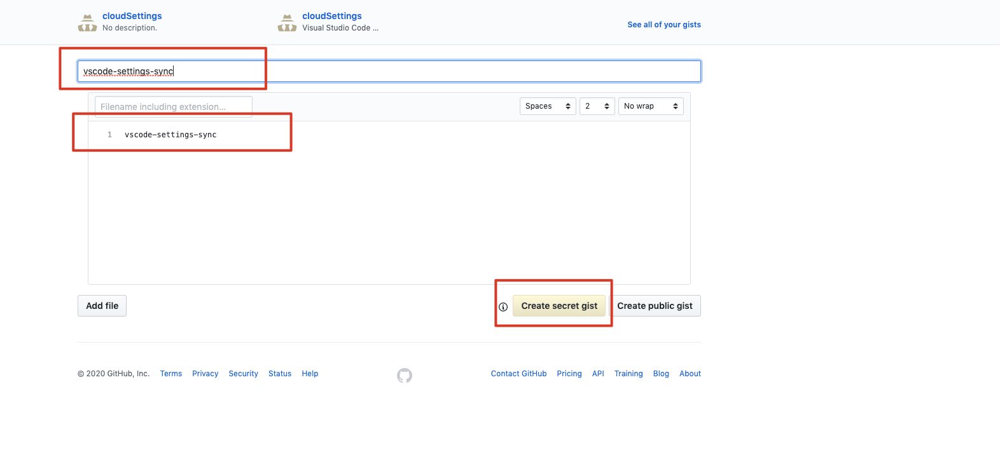

手动复制刚才创建的 Gist 仓库的 ID：它显示在浏览器 url 最后一串字符串或者截图中第二个框 gist 冒号后面的字符串（如下图）把它保存在你的记事本中

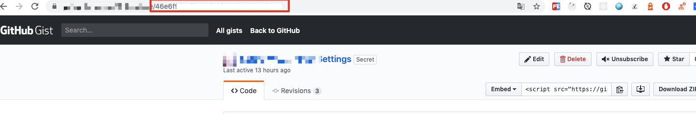

回到 VSCode 编辑器中 使用快捷键`Ctrl+P` 输入命令 `>sync` 点击 **同步：高级选项**

ps：如果有问题，可以点红框下面的 **扩展设置重置** 它不会清除你现有的扩展，只恢复初始 sync 的配置） 快捷键的用法是 **Ctrl+P** 输入命令：**>Sync: Reset Extension Settings**

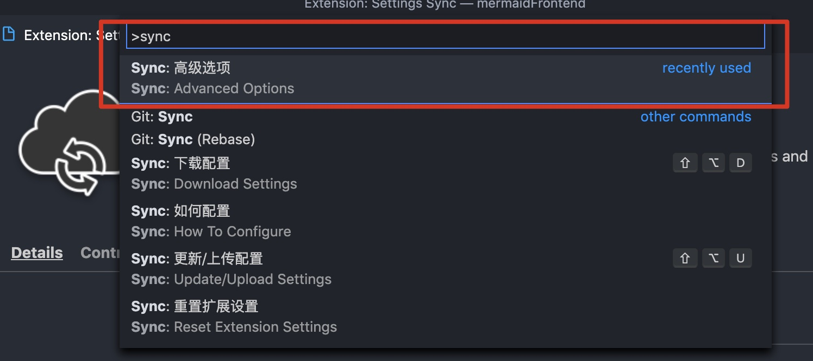

然后选择同步：编辑配置设置

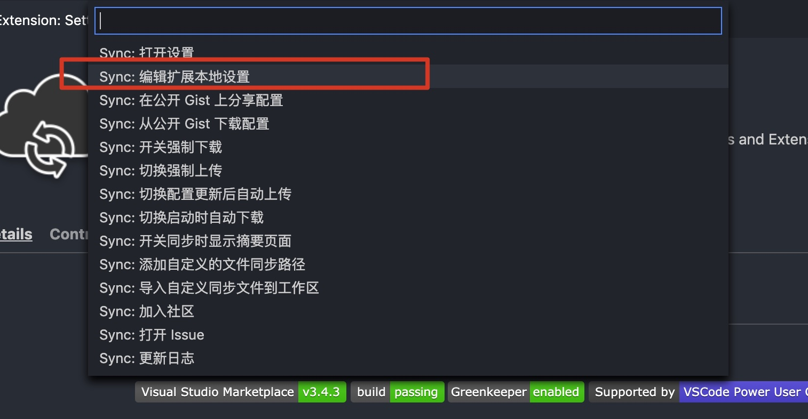

输入你在 github 上创建的 gist token 记得使用`Ctrl+S`保存更改

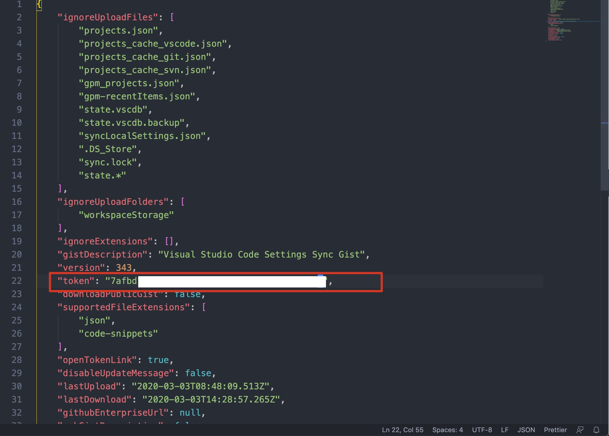

然后如下图进入 Settings Sync 扩展设置页面设置

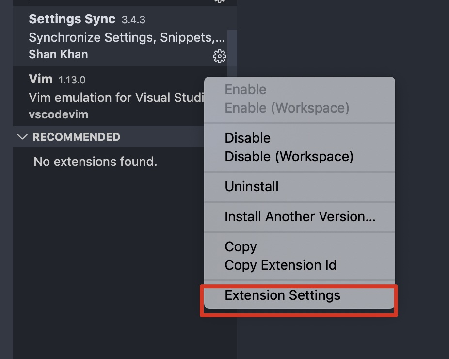

输入创建的 Gist 仓库 ID 输入自动保存设置

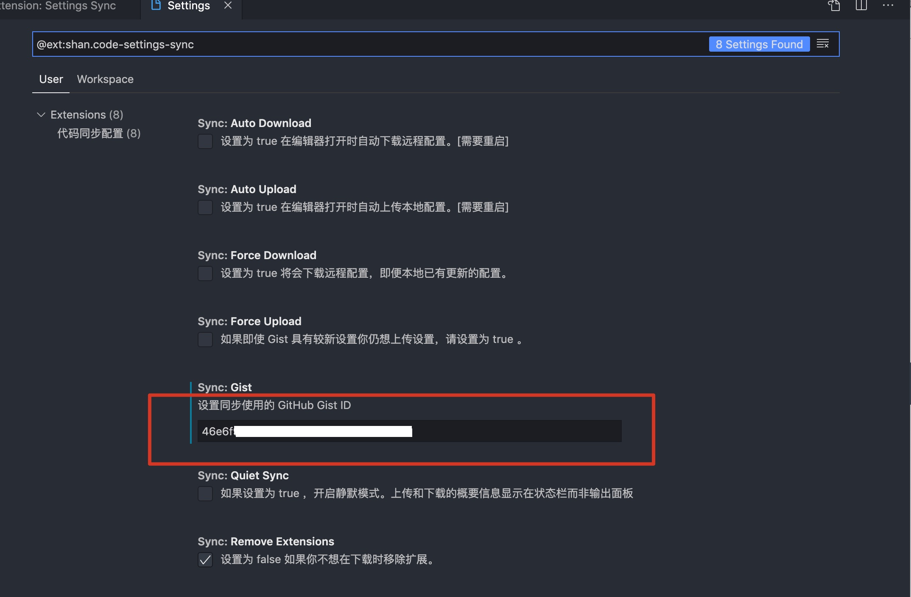

使用 Settings Sync 我们需要记住两个快捷键：

`Shift + Alt + U` 将配置环境 扩展插件信息上传到云端

`Shift + Alt + D` 下载云端的配置

所以我们接着上一步 直接在 VSCode 中使用`Shift + Alt + U`

Settings Sync 扩展 会在输出区域提示。

你还可以在你的 Gist 仓库中查看，看看 Settings Sync 上传了什么

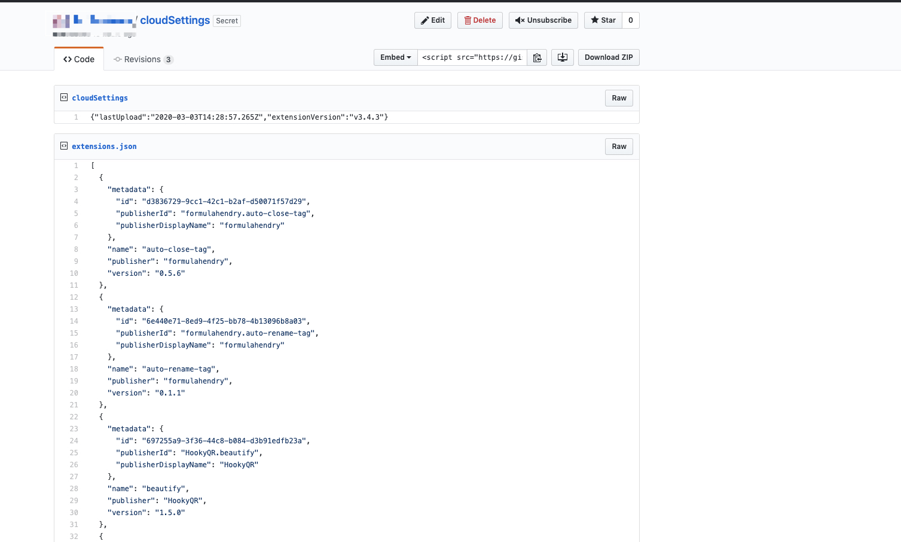

## 已有配置 直接下载同步远端配置

假设我刚才是在用公司的电脑进行了一次初始化同步设置。现在我想起来我家里的电脑已经设置好了，而且安装的插件更多，有的插件我都忘记了名字。那么我只需要拉取家中 Settings Sync 配置中对应的 Gist ID 即可做到 公司和家中用的是同一套 VSCode 的配置。

下面我们来实际操作一次。

查看我们的 Gist 仓库，获取你想要拉取的 Gist ID。截图中，红框中的就是昨晚我在家中最后同步的 Gist 配置了。点击进入 复制这个`Gist ID`

更改 Settings Sync 中的`Gist ID`设置：

快捷键`Shift+Alt+D` 下载配置

同步成功 需要**重启**VSCode

PS：这里可以思考一下，为什么第一次设置 Settings Sync 需要创建 Token 这里就不需要设置 Token 了，其实你可以这么理解 Gist ID 它用来标记你的仓库号码 你可能有多个仓库 你的仓库大门用的都是刷脸验证（令牌 Token 验证），也就是说。Token 你只需要创建一个对应 Gist 的 Token 即可(多个也可以) 它们都可以打开你的 Token，因为在第之前我设置好了 token，所以这里我只需要设置好 Settings Sync 相应的仓库号码。就可以完成同步了。

## 总结

1. 扩展设置重置
   它不会清除你现有的扩展，只恢复初始 sync 的配置） 快捷键的用法是 `Ctrl+P` 输入命令：`>Sync: Reset Extension Settings`

2. 更改 Settings Sync 配置文本#
   设置 Token ID

3. 设置 Gist ID
   然后同步上传或者下载配置
