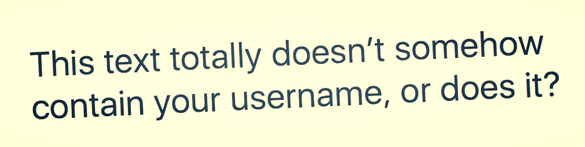

# 零宽度字符

## 什么是零宽字符

零宽字符都是不可见的「非打印」字符，大多数应用程序中都不会显示这些字符。

它们存在于页面中主要用于调整字符的显示格式，下面就是一些常见的零宽度字符及它们的 `unicode` 码和原本用途：

1. 零宽度空格符 (zero-width space) `U+200B` : 用于较长单词的换行分隔

1. 零宽度非断空格符 (zero width no-break space) `U+FEFF` : 用于阻止特定位置的换行分隔

1. 零宽度连字符 (zero-width joiner) `U+200D` : 用于阿拉伯文与印度语系等文字中，使不会发生连字的字符间产生连字效果

1. 零宽度断字符 (zero-width non-joiner) `U+200C` : 用于阿拉伯文，德文，印度语系等文字中，阻止会发生连字的字符间的连字效果

1. 左至右符 (left-to-right mark) `U+200E` : 用于在混合文字方向的多种语言文本中（例：混合左至右书写的英语与右至左书写的希伯来语），规定排版文字书写方向为左至右 1.右至左符 (right-to-left mark) U+200F : 用于在混合文字方向的多种语言文本中，规定排版文字书写方向为右至左

## 零宽字符能做什么

### 1. 传递隐密信息

利用零宽度字符不可见的特性，我们可以用零宽度字符在任何未对零宽度字符做过滤的网页内插入不可见的隐形文本。比如，我在这句话中添加了十个零宽字符 ​​​​​​​​​​，你能分辨出来吗？（提示：将句子粘贴到 [Diff Checker](https://www.diffchecker.com/diff) 来查看这些字符的位置。这些字符可以被用于做某些用户的「指纹」字符。）



下面是一个简单的利用零宽度字符对文本进行`加密`与`解密`的`JavaScript`例子：

[交互式 demo](./demo/index.html)

**加密**

```js
// 将文本中的每个字符转换成二进制
const textToBinary = text =>
  Array.from(text).map(char => char.charCodeAt(0).toString(2));

// 遍历二进制字符串，并将每个 1 转换成零宽字符空间，将 0 转换为零宽非连接字符。一旦我们转换了字母，我们在移动到下一个字符前插入一个零宽链接字符。
const binaryToZeroWidth = binary =>
  binary
    .map(
      b =>
        Array.from(b)
          .map(num => {
            if (num === "1") {
              // zero-width space
              return "​";
            } else {
              // zero-width non-joiner
              return "‌";
            }
          })
          .join("") // zero-width no-break space
    )
    .join("‍"); // zero-width joiner

// 此时encodeText中包含的就是一串不可见的加密文本了
const encodedText = text => {
  const binaryText = textToBinary(text);
  return binaryToZeroWidth(binaryText);
};
```

**解密**

将逻辑反过来

```js
// 将加密的文本转回成二进制数组
const zeroWidthToBinary = encoded =>
  encoded
    .split("‍") // zero-width joiner
    .map(b =>
      Array.from(b)
        .map(z => (z === "​" ? "1" : "0")) // // zero-width space
        .join("")
    );

// 最后一步只需要将二进制文本转回十进制，再使用 String.fromCodePoint 就可以得到原文本了
const binaryToText = string =>
  string.map(b => String.fromCodePoint(parseInt(b, 2))).join("");

// 此时decodedText就是解密的文本
const decodedText = encoded => {
  const binaryString = zeroWidthToBinary(encoded);
  return binaryToText(binaryString);
};
```

> 注：在使用零宽度字符进行加密时，请尽量避免将加密后的隐形文本插入在明文的开头或者结尾处，以此来避免隐形文本在复制时被遗漏

应用

- 隐形水印

  通过零宽度字符我们可以对内部文件添加隐形水印

- 加密信息分享

  通过零宽度字符我们可以在任何网站上分享任何信息

## 2. 逃脱词匹配

逃脱敏感词过滤

```js
// 利用零宽度字符来分隔敏感词
const censored = "敏感词";

let censor = censored.replace(/敏感词/g, ""); // ''

// 使用零宽度空格符对字符串进行分隔
const uncensored = Array.from(censored).join("​");

censor = uncensored.replace(/敏感词/g, ""); // '敏​感​词'
```

## 小结

请酌情谨慎处理这些隐形的字符

## 参考链接

- [Be careful what you copy: Invisibly inserting usernames into text with Zero-Width Characters](https://medium.com/@umpox/be-careful-what-you-copy-invisibly-inserting-usernames-into-text-with-zero-width-characters-18b4e6f17b66)
- [零宽度字符：和谐？屏蔽？不存在的](https://juejin.im/post/5b87a6e26fb9a019b953ee8b)
